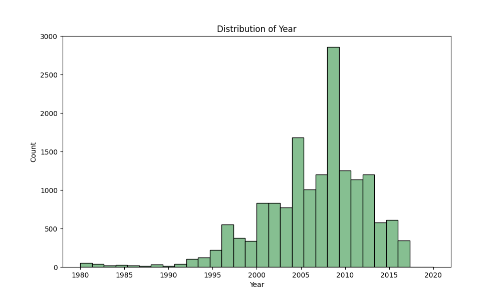
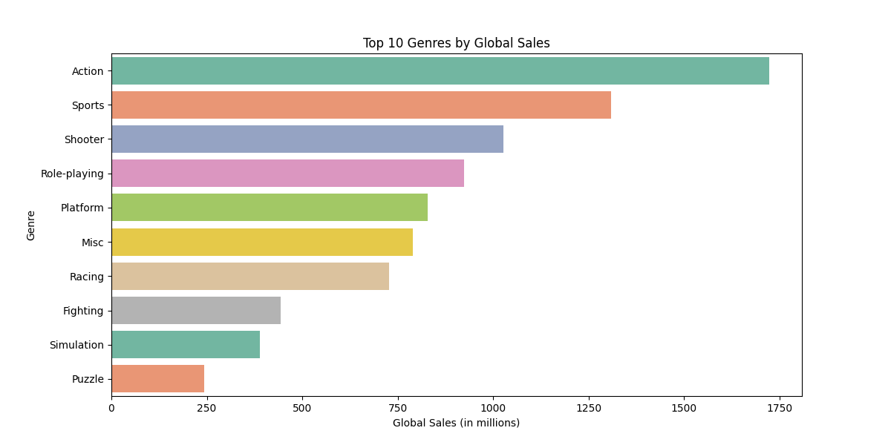

# Video Game Sales Analysis

## Project Description
This project is aiming at a detailed review of sales of video games. This will include preparing data, along with exploratory data analysis (EDA), and visualizations in order to discover trends and insights. In the dataset, one can find video game sales by platform, genre, and region that are being analyzed.

## Setup Instructions

Step 1. Clone the repository: 
```python
git clone https://github.com/ExiledPhobos/Video-Game-Sales-Analysis.git
```
Step 2. Navigate to the project directory: 
```python
cd video-game-sales-analysis
```
Step 3. Set up a virtual environment:
```python
python -m venv venv
source venv/bin/activate
```
Step 4. Install the dependencies: 
```python
pip install -r requirements.txt
```
## Usage

Step 1. Run `scripts/data_cleaning.py` to clean the raw data.

Step 2. Run `scripts/eda_and_visualization.py` to perform EDA and generate visualizations.

## Results

The results of the analysis can be found in the `reports/figures` folder, and a summary of the findings in `reports/summary_report.md`.

## Sample Output

### Distribution of Year


### Top 10 Genres by Global Sales
